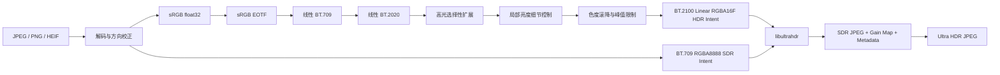

# HDRfy

HDRfy 将普通 SDR `JPEG / PNG / HEIF / HEIC / AVIF` 照片转换为可在兼容设备上实际触发 HDR 显示的 **Ultra HDR JPEG**，而不是简单提亮后保存一张普通图片。

项目当前采用两层结构：

1. Python 负责解码、色彩空间转换和单张 SDR 图像的逆色调映射；
2. Google [`libultrahdr`](https://github.com/google/libultrahdr) 参考编码器负责计算 Gain Map，并将 SDR 基础图、增益图和标准元数据封装为向下兼容的 JPEG。

不支持 Ultra HDR 的查看器仍会显示正常 SDR 底图；支持 Ultra HDR 且连接 HDR 屏幕的系统会读取 Gain Map，恢复更高的高光亮度。

## 当前能力

- 输入 JPEG、PNG、HEIF、HEIC 和 AVIF；
- 使用 `float32` 线性光处理，不在 8-bit 图像上直接乘亮度；
- 将线性 BT.709/sRGB 转换到线性 BT.2020；
- 提供 `conservative`、`natural`、`vivid` 三种确定性逆色调映射预设；
- HDR 意图以 BT.2100 线性 `RGBA16F` 交给 `libultrahdr`；
- SDR 意图以 BT.709 `RGBA8888` 交给 `libultrahdr`；
- 默认 203 nit 参考白、1000 nit 峰值亮度；
- 自动生成多通道 Gain Map 和 Ultra HDR JPEG；
- 编码结束后调用 `libultrahdr` Probe 模式验证 Gain Map 元数据；
- 检测带 PQ/HLG NCLX 标记的现有 HDR HEIF，避免重复 HDR 化；
- 默认对奇数尺寸执行最多一像素的边缘填充，规避部分 `libultrahdr` 版本的奇数尺寸风险；
- 可保留 EXIF，并可导出中间 `RGBA16F`、`RGBA8888` 和线性 BT.2020 NumPy 数据。

## 处理流程



## 安装

需要 Python 3.10 或更高版本：

```bash
python -m venv .venv
```

Linux / macOS：

```bash
source .venv/bin/activate
python -m pip install -U pip
python -m pip install -e .
```

Windows PowerShell：

```powershell
.venv\Scripts\Activate.ps1
python -m pip install -U pip
python -m pip install -e .
```

## 构建 libultrahdr

HDRfy 不自行实现或伪造 Ultra HDR 容器，而是调用官方参考编码器。以下命令会把源码和构建产物放进 `.tools/libultrahdr`，不会安装到系统目录：

```bash
hdrfy build-ultrahdr
```

默认构建 `google/libultrahdr` 的 `main` 分支，并让其自行构建 JPEG 依赖。已有系统 `libjpeg` 时可使用：

```bash
hdrfy build-ultrahdr --system-jpeg
```

也可以固定到指定标签、分支或提交：

```bash
hdrfy build-ultrahdr --ref <tag-or-commit>
```

构建工具要求：

- Git；
- CMake 3.15 或更高版本；
- 支持 C++17 的编译器；
- 推荐 Ninja；
- Windows 推荐 MSYS2 UCRT64 或 Visual Studio C++ Build Tools。

也可以直接指定已有的编码器：

```bash
hdrfy convert input.jpg output_hdr.jpg --ultrahdr-bin /path/to/ultrahdr_app
```

或者设置环境变量：

```bash
export HDRFY_ULTRAHDR_BIN=/path/to/ultrahdr_app
```

Windows PowerShell：

```powershell
$env:HDRFY_ULTRAHDR_BIN = "D:\tools\libultrahdr\ultrahdr_app.exe"
```

## 使用

默认自然预设、1000 nit 峰值：

```bash
hdrfy convert input.jpg output_hdr.jpg
```

处理 PNG 或 HEIF：

```bash
hdrfy convert input.png output_hdr.jpg
hdrfy convert input.heic output_hdr.jpg
```

保守模式，适合人像和已经有较强对比度的照片：

```bash
hdrfy convert input.jpg output_hdr.jpg \
  --preset conservative \
  --peak-nits 800
```

更强的高光效果：

```bash
hdrfy convert input.jpg output_hdr.jpg \
  --preset vivid \
  --peak-nits 1200 \
  --gainmap-quality 98
```

保留调试中间文件：

```bash
hdrfy convert input.jpg output_hdr.jpg \
  --keep-intermediates artifacts/debug
```

该目录会包含：

```text
hdr_intent_rgba16f.raw
sdr_intent_rgba8888.raw
hdr_intent_linear_bt2020.npy
source.exif                 # 输入含 EXIF 时
```

检查现有文件是否能被参考解码器识别为 Ultra HDR：

```bash
hdrfy inspect output_hdr.jpg
```

## 参数含义

```text
--preset conservative|natural|vivid
--peak-nits 1000
--reference-white-nits 203
--quality 95
--gainmap-quality 95
--gainmap-scale 2
--single-channel-gainmap
--strip-exif
--no-pad-even
--force-sdr-heif
--no-verify
```

`peak_nits / reference_white_nits` 决定最大内容亮度增益。例如默认配置为：

```text
1000 / 203 = 4.926 倍
```

该值不是对整张图统一乘 4.926，而是只通过平滑曲线逐渐作用于高亮区域；暗部和大部分中间调保持接近原始 SDR 亮度。

## HEIF 输入说明

HDRfy 使用 `pillow-heif` 的 10/12-bit 解码路径读取 HEIF 系列文件，并检查 NCLX `transfer_characteristics`：

- `16`：PQ；
- `18`：HLG。

检测到这些标记时，程序默认拒绝进入 SDR-to-HDR 重建路径，因为再次扩展会造成亮度和颜色错误。只有在确认源文件元数据本身错误时，才使用：

```bash
hdrfy convert incorrectly_tagged.heic output_hdr.jpg --force-sdr-heif
```

## 算法边界

单张 SDR 照片已经裁掉的高光纹理无法被物理恢复。当前算法做的是确定性的逆色调映射：根据原图亮度结构重建合理的显示亮度，并对高光细节做有限增强，不凭空生成太阳、灯具或天空纹理。

因此当前版本适合：

- 验证真正的 HDR 静态图片编码链路；
- 将普通照片转换成兼容性较好的 Ultra HDR JPEG；
- 为后续接入 LHDR、HDRTVDM 等神经网络后端提供稳定的输入输出与色彩管理框架。

它不承诺恢复相机传感器已经丢失的信息，也不会把普通 16-bit PNG 错称为可显示 HDR。

## 开发测试

```bash
python -m pip install -e .[dev]
pytest
ruff check .
```

单元测试覆盖：

- sRGB 传递函数往返；
- BT.709 与 BT.2020 矩阵往返；
- 亮度计算；
- 逆色调映射范围和稳定性；
- `RGBA16F`、`RGBA8888` 原始内存布局；
- `ultrahdr_app` 命令行参数契约；
- 端到端 Python 管线的模拟编码与 Probe 验证。

## 后续路线

当前 `reconstruct_hdr_linear_bt2020()` 是独立重建边界。后续可以新增统一后端接口，把确定性算法替换为预训练单图 HDR 重建模型，而不修改解码、色彩管理、Gain Map 编码和验证模块。
