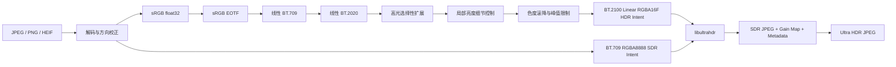

# HDRfy

HDRfy 将普通 SDR `JPEG / PNG / HEIF / HEIC / AVIF` 照片转换为可在兼容设备上实际触发 HDR 显示的 **Ultra HDR JPEG**，而不是简单提亮后保存普通图片。

项目由两部分组成：

1. Python 负责图像解码、色彩空间转换和 SDR-to-HDR 逆色调映射；
2. Google [`libultrahdr`](https://github.com/google/libultrahdr) 参考编码器负责计算 Gain Map，并将 SDR 基础图、增益图和标准元数据封装成向下兼容的 JPEG。

不支持 Ultra HDR 的查看器会显示正常的 SDR 底图；支持 Ultra HDR 且连接 HDR 屏幕的系统会读取 Gain Map，恢复更高的高光亮度。

## 当前能力

- 输入 JPEG、PNG、HEIF、HEIC 和 AVIF；
- 单文件转换与目录批处理；
- 所有路径和算法参数集中写在 `run_hdrfy.py` 顶部；
- 运行时不需要在命令行指定输入路径或 HDR 参数；
- 使用 `float32` 线性光处理，不在 8-bit 图像上直接乘亮度；
- 将线性 BT.709/sRGB 转换到线性 BT.2020；
- 提供 `conservative`、`natural`、`vivid` 三种逆色调映射预设；
- HDR Intent 使用 BT.2100 线性 `RGBA16F`；
- SDR Intent 使用 BT.709 `RGBA8888`；
- 默认 203 nit 参考白、1000 nit 峰值亮度；
- 自动生成多通道 Gain Map 和 Ultra HDR JPEG；
- 编码结束后调用 `libultrahdr` Probe 模式验证输出；
- 检测带 PQ/HLG NCLX 标记的 HDR HEIF，避免重复 HDR 化；
- 默认对奇数尺寸执行最多一像素边缘填充；
- 可保留 EXIF 和调试中间文件；
- 未找到 `ultrahdr_app` 时可由脚本自动下载并构建。

## 安装

需要 Python 3.10 或更高版本。

```bash
python -m venv .venv
```

Linux / macOS：

```bash
source .venv/bin/activate
python -m pip install -U pip
python -m pip install -e .
```

Windows PowerShell：

```powershell
.venv\Scripts\Activate.ps1
python -m pip install -U pip
python -m pip install -e .
```

构建 `libultrahdr` 还需要：

- Git；
- CMake 3.15 或更高版本；
- 支持 C++17 的编译器；
- 推荐安装 Ninja；
- Windows 推荐 Visual Studio C++ Build Tools 或 MSYS2 UCRT64。

## 使用方式

不需要在命令行传递路径和参数。只修改根目录的：

```text
run_hdrfy.py
```

然后直接运行：

```bash
python run_hdrfy.py
```

### 1. 设置输入输出路径

打开 `run_hdrfy.py`，修改：

```python
INPUT_PATH = Path(r"input")
OUTPUT_PATH = Path(r"output")
```

所有相对路径均相对于仓库根目录，而不是终端当前工作目录。

单文件输入并指定确切输出文件：

```python
INPUT_PATH = Path(r"photos/source.heic")
OUTPUT_PATH = Path(r"results/source_hdr.jpg")
```

单文件输入并让程序自动命名：

```python
INPUT_PATH = Path(r"photos/source.heic")
OUTPUT_PATH = Path(r"results")
OUTPUT_NAME_SUFFIX = "_hdr"
```

输出为：

```text
results/source_hdr.jpg
```

目录批处理：

```python
INPUT_PATH = Path(r"photos")
OUTPUT_PATH = Path(r"results")
RECURSIVE = True
```

程序会保留输入目录层级。例如：

```text
photos/trip/day1/a.heic
```

输出为：

```text
results/trip/day1/a_hdr.jpg
```

### 2. 调节 HDR 效果

自然模式：

```python
PRESET = "natural"
PEAK_NITS = 1000.0
REFERENCE_WHITE_NITS = 203.0
```

保守模式，适合人像或对比度已经较强的照片：

```python
PRESET = "conservative"
PEAK_NITS = 800.0
```

较强高光效果：

```python
PRESET = "vivid"
PEAK_NITS = 1200.0
GAINMAP_QUALITY = 98
```

`PEAK_NITS / REFERENCE_WHITE_NITS` 决定最大内容亮度增益。默认值为：

```text
1000 / 203 = 4.926 倍
```

该增益不会统一乘到整张图上，而是通过平滑曲线主要作用于高亮区域；暗部和大部分中间调保持接近原始 SDR 亮度。

### 3. 调节 JPEG 和 Gain Map

```python
BASE_JPEG_QUALITY = 95
GAINMAP_QUALITY = 95
GAINMAP_SCALE = 2
MULTI_CHANNEL_GAINMAP = True
```

一般不建议把 `GAINMAP_SCALE` 调得过大，否则增益图空间分辨率下降，细小高光边缘可能不够准确。

### 4. 设置批处理行为

```python
RECURSIVE = True
OVERWRITE_EXISTING = False
STOP_ON_ERROR = False
OUTPUT_NAME_SUFFIX = "_hdr"
```

含义：

- `RECURSIVE=True`：递归处理子目录；
- `OVERWRITE_EXISTING=False`：已有输出时跳过；
- `STOP_ON_ERROR=False`：某张图失败后继续处理其他图片；
- `OUTPUT_NAME_SUFFIX="_hdr"`：自动输出文件名后缀。

当输出目录位于输入目录内部时，程序会跳过输出目录，避免下一次运行重新处理已经生成的 HDR 图片。

### 5. 设置参考编码器

默认配置：

```python
ULTRAHDR_BINARY = None
AUTO_BUILD_ULTRAHDR = True
LIBULTRAHDR_BUILD_DIR = Path(r".tools/libultrahdr")
LIBULTRAHDR_REF = "main"
LIBULTRAHDR_BUILD_JOBS = None
LIBULTRAHDR_BUILD_DEPENDENCIES = True
```

程序会依次查找：

1. `ULTRAHDR_BINARY` 指定的文件；
2. `HDRFY_ULTRAHDR_BIN` 环境变量；
3. 系统 `PATH`；
4. 项目 `.tools/libultrahdr` 构建目录。

仍未找到且 `AUTO_BUILD_ULTRAHDR=True` 时，会自动下载并构建 Google `libultrahdr`。

已有编码器时可直接在脚本中写绝对路径：

```python
ULTRAHDR_BINARY = Path(r"D:\tools\libultrahdr\ultrahdr_app.exe")
AUTO_BUILD_ULTRAHDR = False
```

Linux 示例：

```python
ULTRAHDR_BINARY = Path(r"/home/user/tools/libultrahdr/ultrahdr_app")
AUTO_BUILD_ULTRAHDR = False
```

### 6. 保留调试中间结果

```python
KEEP_INTERMEDIATES = True
INTERMEDIATES_PATH = Path(r"artifacts/intermediates")
```

每张图会使用独立子目录，包含：

```text
hdr_intent_rgba16f.raw
sdr_intent_rgba8888.raw
hdr_intent_linear_bt2020.npy
source.exif
```

### 7. 输入和验证设置

```python
PAD_ODD_DIMENSIONS_TO_EVEN = True
PRESERVE_EXIF = True
FORCE_SDR_HEIF = False
VERIFY_OUTPUT = True
```

- `PAD_ODD_DIMENSIONS_TO_EVEN`：奇数宽高时复制最后一行或一列；
- `PRESERVE_EXIF`：将输入 EXIF 交给 Ultra HDR 编码器；
- `FORCE_SDR_HEIF`：忽略 HEIF 的 PQ/HLG 标记，通常应保持 `False`；
- `VERIFY_OUTPUT`：编码后使用 Probe 模式检查 Gain Map 元数据。

## HEIF 输入说明

HDRfy 使用 `pillow-heif` 的高位深路径读取 HEIF 系列文件，并检查 NCLX `transfer_characteristics`：

- `16`：PQ；
- `18`：HLG。

检测到这些标记时，程序默认拒绝进入 SDR-to-HDR 重建路径，因为重复扩展会导致亮度和颜色错误。只有确认源文件被错误标记时，才设置：

```python
FORCE_SDR_HEIF = True
```

## 处理流程



## 命令行入口

项目仍保留 `hdrfy convert`、`hdrfy inspect` 和 `hdrfy build-ultrahdr`，用于自动化集成和测试，但普通使用不依赖这些命令。默认推荐入口始终是：

```bash
python run_hdrfy.py
```

## 算法边界

单张 SDR 照片中已经裁掉的高光纹理无法被物理恢复。当前算法执行确定性逆色调映射：根据原图亮度结构重建合理的显示亮度，并对高光细节做有限增强，不凭空生成太阳、灯具或天空纹理。

当前版本适合：

- 验证真正的 HDR 静态图片编码链路；
- 将普通照片转换成兼容性较好的 Ultra HDR JPEG；
- 为后续接入 LHDR、HDRTVDM 等神经网络后端提供稳定框架。

它不承诺恢复传感器已经丢失的信息，也不会把普通 16-bit PNG 错称为可显示 HDR。

## 开发测试

```bash
python -m pip install -e .[dev]
pytest
ruff check .
```

测试覆盖色彩转换、逆色调映射、原始内存布局、编码器参数契约、HEIF 元数据、端到端管线，以及脚本配置入口的单文件和目录批处理路径规划。
