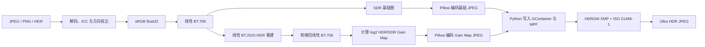

# HDRfy

HDRfy 将普通 SDR `JPEG / PNG / HEIF / HEIC / AVIF` 照片转换为带 Gain Map 的 **Ultra HDR JPEG**。输出文件保留正常 SDR 基础图，因此普通查看器仍能打开；支持 Ultra HDR 且连接 HDR 屏幕的系统可读取增益图并提高高光显示亮度。

当前版本从提交 `4812dc8` 的外部 `libultrahdr` 架构改为项目层纯 Python 实现：

- 不需要 Visual Studio、MSVC、GCC、CMake 或 Ninja；
- 不下载或编译 `libultrahdr`；
- 不调用 `ultrahdr_app.exe` 或其他外部程序；
- Python 直接计算 Gain Map，并写入 MPF、GContainer XMP、HDR Gain Map XMP 和 ISO 21496-1 APP2 元数据；
- JPEG/HEIF 编解码由通过 `pip` 安装的 Pillow 和 pillow-heif wheel 提供。

这里的“纯 Python”指 HDRfy 自身不包含、编译或调用 C/C++ 工程。Pillow、NumPy、pillow-heif 的官方 wheel 内部仍使用经过预编译的原生库，这是实用 JPEG/HEIF 支持所必需的，但用户不需要安装任何编译环境。

## 当前能力

- 输入 JPEG、PNG、HEIF、HEIC 和 AVIF；
- 单文件转换与递归目录批处理；
- 路径和全部参数集中写在 `run_hdrfy.py` 顶部；
- `float32` 线性光 SDR-to-HDR 重建；
- 线性 BT.709/sRGB 与 BT.2020 色域转换；
- `conservative`、`natural`、`vivid` 三种预设；
- 单通道或三通道 Gain Map；
- 输出 Ultra HDR v1 的 MPF、GContainer 和 HDRGM XMP；
- 同时写入 ISO 21496-1 Gain Map 元数据；
- 内置结构检查器验证双 JPEG、Gain Map 和元数据；
- 保留 EXIF，支持导出 HDR Intent、SDR Intent 和 Gain Map；
- 直接支持奇数宽高，不需要为外部编码器补边。

## 安装

需要 Python 3.10 或更高版本，推荐 Python 3.12：

```powershell
conda create -n hdrfy312 python=3.12 pip -y
cd /d Path_to\HDRfy
python -m pip install -U pip
python -m pip install -e .
```

不需要安装 Visual Studio、Visual Studio Build Tools、MSYS2、CMake 或 C++ 编译器。

## 默认使用方式

打开仓库根目录的：

```text
run_hdrfy.py
```

只修改顶部配置区，然后运行：

```powershell
python Path_to\HDRfy\run_hdrfy.py
```

### 单张图片

```python
INPUT_PATH = Path(r"Path_to\source.heic")
OUTPUT_PATH = Path(r"Path_to\source_hdr.jpg")
```

也可以让程序自动命名：

```python
INPUT_PATH = Path(r"Path_to\source.heic")
OUTPUT_PATH = Path(r"Path_to\HDR")
OUTPUT_NAME_SUFFIX = "_hdr"
```

### 整个目录

```python
INPUT_PATH = Path(r"Path_to\SDR")
OUTPUT_PATH = Path(r"Path_to\HDR")
RECURSIVE = True
OVERWRITE_EXISTING = False
STOP_ON_ERROR = False
```

程序会保留输入目录的相对子目录结构，并跳过位于输入目录内部的输出树。

## HDR 参数

默认自然模式：

```python
PRESET = "natural"
PEAK_NITS = 1000.0
REFERENCE_WHITE_NITS = 203.0
```

保守模式：

```python
PRESET = "conservative"
PEAK_NITS = 800.0
```

较强高光：

```python
PRESET = "vivid"
PEAK_NITS = 1200.0
GAINMAP_QUALITY = 98
```

最大内容增益为：

```text
PEAK_NITS / REFERENCE_WHITE_NITS
```

默认约为 `1000 / 203 = 4.926` 倍。该增益只按亮度结构逐渐作用于高光，而不是把整张照片统一乘亮度。

## Gain Map 与 JPEG 参数

```python
BASE_JPEG_QUALITY = 95
GAINMAP_QUALITY = 95
GAINMAP_SCALE = 2
MULTI_CHANNEL_GAINMAP = True
```

- `BASE_JPEG_QUALITY`：普通 SDR 基础图质量；
- `GAINMAP_QUALITY`：增益图 JPEG 质量；
- `GAINMAP_SCALE=2`：Gain Map 宽高约为原图的一半；
- `MULTI_CHANNEL_GAINMAP=True`：分别记录 RGB 增益，颜色高光通常更准确；
- 设置为 `False` 时使用单通道亮度 Gain Map，文件略小。

## 输入、元数据与调试

```python
PAD_ODD_DIMENSIONS_TO_EVEN = False
PRESERVE_EXIF = True
FORCE_SDR_HEIF = False
VERIFY_OUTPUT = True

KEEP_INTERMEDIATES = False
INTERMEDIATES_PATH = Path(r"artifacts/intermediates")
```

纯 Python 编码器原生支持奇数尺寸，因此 `PAD_ODD_DIMENSIONS_TO_EVEN` 默认关闭。只有为了兼容旧流程时才需要打开。

启用 `KEEP_INTERMEDIATES` 后，每张图的独立目录中会生成：

```text
hdr_intent_linear_bt2020.npy
sdr_intent_srgb.npy
gainmap.png
```

## HEIF 输入

程序检查 HEIF/HEIC/AVIF 的 NCLX 传递函数：

- `16`：PQ；
- `18`：HLG。

检测到已有 HDR 标记时默认停止，避免重复 HDR 化。只有确认源文件元数据错误时才设置：

```python
FORCE_SDR_HEIF = True
```

## 处理流程



Gain Map 计算使用相同色彩原色下 HDR 与 SDR 的线性亮度比，并采用 `1/64` 偏移抑制暗部除零和噪声放大。三通道模式逐通道计算，单通道模式使用 BT.709 亮度。

## 内置验证

每次输出后，程序默认检查：

- 主图和 Gain Map 是否均为可解码 JPEG；
- MPF 是否存在；
- MPF 主图尺寸是否准确指向第二张 JPEG 的 SOI；
- GContainer 是否声明 `Primary` 和 `GainMap`；
- Gain Map 是否包含 HDRGM XMP；
- 主图和增益图是否包含 ISO 21496-1 标记。

也可以使用次要 CLI：

```bash
hdrfy inspect output_hdr.jpg
```

## 算法与兼容性边界

单张 SDR 照片中已经被裁掉的高光纹理无法被物理恢复；当前算法执行确定性的逆色调映射，不会凭空生成缺失细节。

纯 Python 封装器已经进行字节级 MPF 偏移和结构测试，但其设备兼容覆盖仍少于 Google `libultrahdr` 参考实现。因此生成后仍应在目标 HDR 手机、Windows HDR 查看器或支持 Ultra HDR 的浏览器中做实际显示验证。结构验证通过不等于所有厂商查看器都会以相同亮度渲染。

## 开发测试

```bash
python -m pip install -e .[dev]
ruff check .
pytest
```

测试覆盖色彩转换、逆色调映射、HEIF 元数据、Gain Map 数值和通道、MPF 精确偏移、GContainer/HDRGM/ISO 21496-1 标记、奇数尺寸、端到端输出及脚本批处理路径规划。
